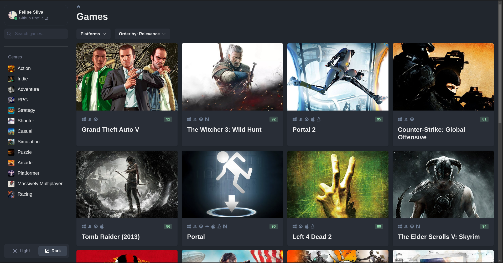
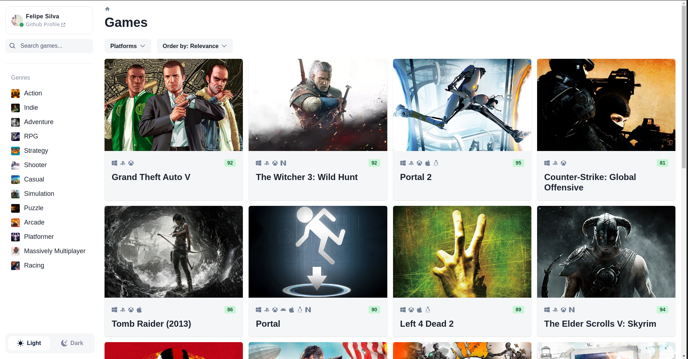
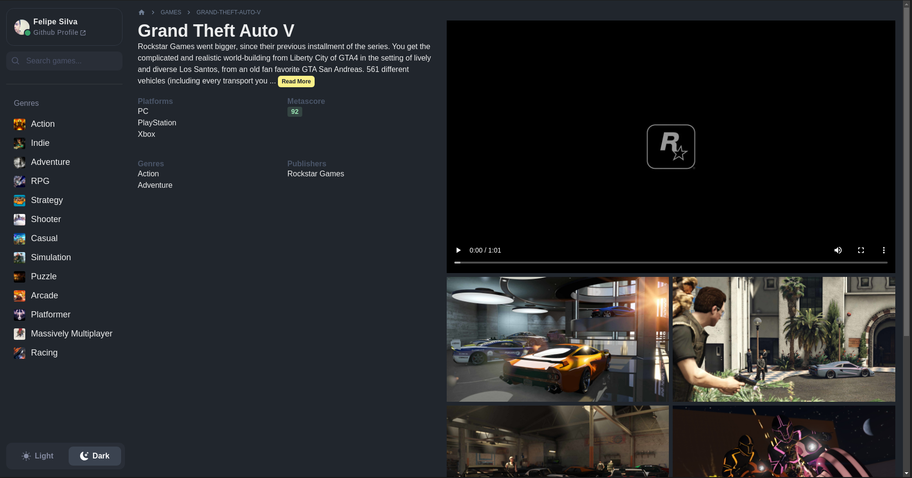

# Games Hub

<br />

### Description:

This project is a Game Catalog built using Chakra, TypeScript, and React. It allows users to filter games by genre and search for their favorite titles. The project was inspired by the layout of [rawg api](https://rawg.io/) and was created for the sole purpose of practicing React and TypeScript concepts.

<br />

#### Vercel live demo:

[<image src='https://upload.wikimedia.org/wikipedia/commons/5/5e/Vercel_logo_black.svg' alt='demo version'> Click here to check out the live demo of the project.](https://react-games-catalog-six.vercel.app/)

<br />

### API Source:

The project utilizes the rawg API for fetching game data, including details, genres, and more.

<br />

### Screenshots:

Dark mode:



<br />

Light mode:



<br />

Details page:



<br />

## 🚀 Technologies

- [Axios](https://github.com/axios/axios)
- [Chakra UI](https://github.com/chakra-ui/chakra-ui)
- [Framer Motion](https://github.com/framer/motion)
- [Ms](https://github.com/vercel/ms)
- [React](https://github.com/facebook/react)
- [React Infinite Scroll](https://github.com/ankeetmaini/react-infinite-scroll-component)
- [React Query](https://tanstack.com/query/v3/)
- [React Router DOM](https://reactrouter.com/en/main)
- [Zustand](https://github.com/pmndrs/zustand)

<br />

## ☕ How to use

To get started with this project, follow these simple steps:

1. Clone the repository::

```bash
git clone https://github.com/felipel7/react-games-catalog.git
```

Navigate to the project directory:

```bash
cd react-games-catalog
```

Build the Docker image:

```bash
docker build -t games .
```

Run the Docker container:

```bash
./run.sh
```

_This will kickstart the development server, and you can access the application at http://localhost:5173_.

<br />

### Development

If you plan to work on the code locally and use tools like TypeScript in Visual Studio Code, you'll need to install the project's dependencies locally. You can do this by running the following command in the project directory:

```bash
yarn install
```

_This will install all the necessary dependencies and set up the local node_modules folder for you_.

<br />

Made with ♡ by [Felipe Silva](https://www.linkedin.com/in/ggfelipesilva/) :)
